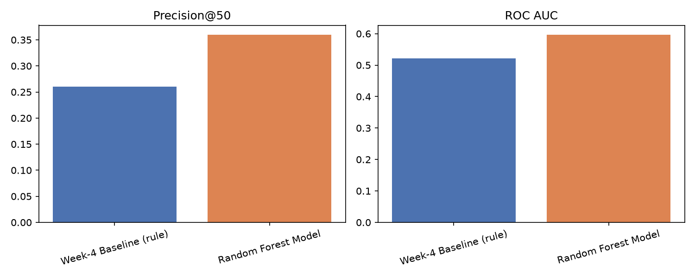
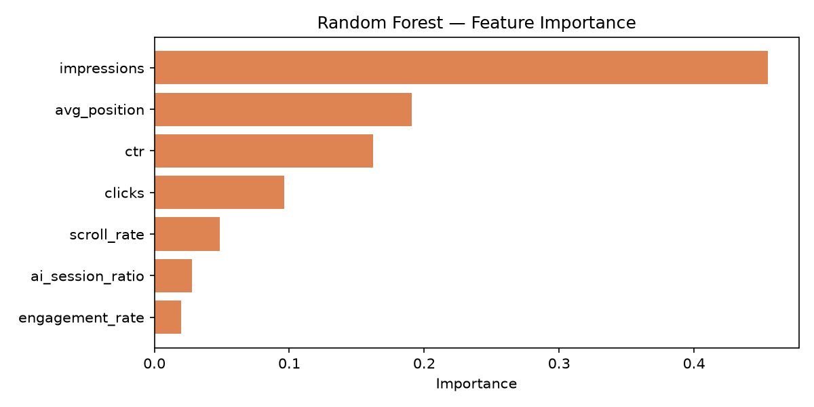
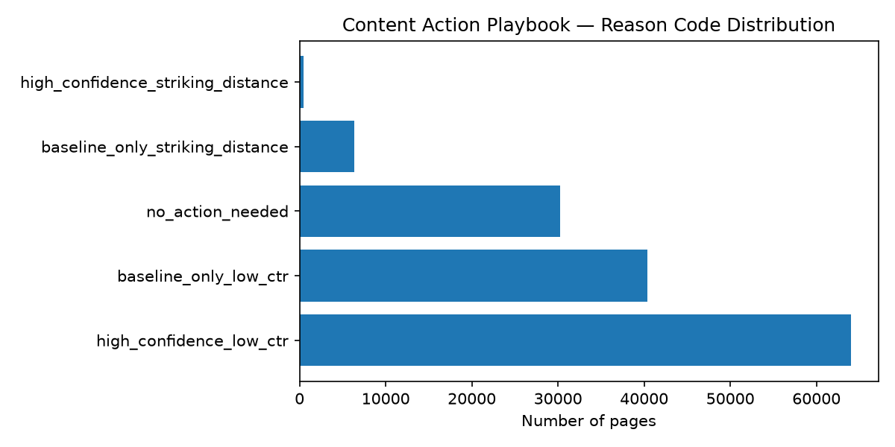

# Capstone Report — Refresh / Content Opportunity Scoring

- **Author: Rifki**
- **Lane: Refresh / Content Opportunity Scoring**
- **Repo: https://github.com/rifkiay/flyrank-ml-internship-starter**
- **Date: 31/08/2026**

## 0. Abstract

Given a content portfolio too large to review manually, which pages should a limited review team check first? This project builds and validates a ranked prioritization system using 9.8 million rows of daily search and engagement data from FlyRank's production warehouse, combining a signal-validated baseline rule with a Random Forest classifier trained on seven observable features. On a reproducible client-grouped holdout split, the model outperformed the baseline on both metrics tested — 0.36 vs. 0.26 Precision@50, and 0.597 vs. 0.521 ROC AUC — a real, verified lift rather than added complexity for its own sake. The output is a ranked queue of roughly 64,000 flagged pages with reason codes and suggested actions, intended strictly as decision support for a human reviewer, not an autonomous or causal claim about what fixes a page's performance.

## 1. Problem framing

FlyRank's content portfolios span hundreds of thousands of pages per client, far more than any editorial team can manually review on a regular basis. The question this project answers is: given a limited reviewer capacity, which pages should be checked first for a content refresh?

The unit of analysis is a single content page, evaluated over a defined time window. The output is a ranked queue — each page carries a score, a reason code explaining why it was flagged, and a suggested action (review CTR and snippet, push toward page one, or monitor). A content reviewer or SEO lead is the person who acts on this output: they open the top-ranked pages, check the reasoning attached to each, and decide whether to refresh, expand, or leave a page alone.

Getting this wrong has a real cost in both directions. Flagging a healthy page wastes a reviewer's limited time. Missing a page that is genuinely losing search visibility means that decline continues unnoticed until the loss becomes expensive to reverse. With a page inventory too large to review by hand, a data-driven ranking turns an impossible task — "review everything" — into a manageable one: review the top candidates, with reasons a human can inspect and challenge.

## 2. Data safety

This project uses the FlyRank ML Internship Warehouse, a pseudonymized snapshot of real production search and engagement data hosted on Hugging Face. The primary table is `fact_content_daily_performance`, at a daily grain (one row per page, per client, per day), combining Google Search Console signals (impressions, clicks, position) with Google Analytics 4 signals (sessions, engagement, scroll). Analysis for this project covers March 2026, split into a feature window (March 1–15) and a separate, non-overlapping label window (March 16–31), used to build a forward-looking proxy label without letting any model see the outcome it is predicting.

Several categories of data were deliberately excluded. FlyRank's own product scores — health score, priority score, and action type — are not shipped in this release, and were excluded on principle even if reconstructed, since training on a product's own decision would only teach a model to reproduce that decision rather than discover independent signal. Pseudonymous identifiers (`client_hash_id`, `content_hash_id`) were used only for joins and for building grouped validation splits, never as model features. For the roughly 96% of rows without Google Analytics 4 coverage, engagement-based features default to zero rather than being imputed, to avoid encoding "missing" as a false signal.

No client names, raw URLs, page titles, or search queries appear anywhere in this project's code, outputs, or this report. All identifiers referenced are pseudonymous hashes used solely for grouping and joins.

## 3. Baseline

Before any model was built, a transparent baseline rule was constructed and validated against real signal tests — not encoded on assumption alone. Two signals were checked directly against bucketed data before being trusted: click-through rate relative to a page's position tier, and search-demand volume for pages sitting just outside page one ("striking distance," positions 11–20).

The first signal held up clearly: weighted CTR dropped steadily from 0.381% in the top three positions down to 0.044% for pages ranked beyond position 50 — confirming that CTR-versus-position is a real, usable signal, consistent with FlyRank's own "Fix CTR" flag logic. The second signal was more mixed: while average impressions in the striking-distance zone were lower than the rest of the portfolio, the median was actually higher (20 vs. 17), revealing that the average was distorted by high-traffic outliers in stronger position tiers. The median comparison — the fairer read — still supported real, meaningful demand at that zone.

Only after this validation was the baseline encoded as a score: half weight on how far a page's CTR falls below its position tier's expected CTR, and half weight on whether the page sits in the striking-distance zone with above-median impression volume. This baseline is a fair comparison point for the model in Section 5, because both are evaluated on the identical held-out test set, using the identical metric.

## 4. Model / analysis

The task is framed as binary classification: predicting whether a page's search demand is likely to decline, with the resulting probability score used to rank pages for review rather than to make a hard yes/no call. A Random Forest classifier (200 trees, max depth 8, class-balanced) was chosen because the baseline's fixed two-signal formula cannot learn interactions across multiple weak signals at once — it can only check one or two conditions in isolation.

The target is a proxy, not a confirmed outcome: a page is labeled as declining if its total impressions in the label window (March 16–31) are more than 20% lower than in the feature window (March 1–15). This reflects a real, measured drop between two time periods, but it does not by itself confirm the cause — seasonality, a search-result-page change, or a genuine content issue would all produce the same label.

Seven features were used, all computed only from the feature window so that nothing from the label period could leak into training: average search position, total impressions, total clicks, click-through rate, engagement rate, scroll rate, and the share of sessions referred from AI tools. Content freshness (days since last update) was considered but left out of the model itself, since the dataset used for this comparison does not carry that field at the daily grain — it appears instead as directional context in Section 7, drawn from the reference research the internship provided.

## 5. Evaluation

The model was evaluated using a client-grouped holdout split, not a random row split. Pages from the same client can share writing style, topic patterns, and baseline traffic levels, so a random split risks a model partly memorizing client-specific patterns rather than learning something that generalizes to a client it has never seen. This risk was not theoretical: a direct comparison confirmed it. A naive random split shared 41 of the roughly 43 clients between the training and test sets, and inflated Precision@50 to 0.80 — more than double the honest client-holdout number of 0.36. The result reported below is the honest one.

On the same client-holdout split, using the same metric, the Random Forest model outperformed the baseline rule on both measures tested:

| Method | Precision@50 | ROC AUC |
|---|---|---|
| Baseline (rule) | 0.26 | 0.521 |
| Random Forest | 0.36 | 0.597 |



For context, the base rate — the share of pages actually declining in this dataset — is 27.7%. Both methods perform meaningfully above that base rate at the top of the ranking, and the model's Precision@50 of 0.36 represents a real, reproducible lift over the baseline's 0.26.

Looking at where the model is wrong is more informative than the summary metrics alone. Its confident false positives are pages already sitting at poor search positions (30–56) with near-zero CTR — pages that were already stable at a low baseline, not actively declining, which the model appears to misread as "getting worse" rather than "already poor." Its confident false negatives are more concerning from a practical standpoint: pages with strong current performance (top-3 position, CTR up to 2.9%) that the model scored as safe but that went on to decline anyway. These are exactly the pages where an early warning matters most, since they have the most traffic left to lose — and it is the model's clearest current blind spot.

## 6. Interpretation

Feature importance from the Random Forest shows the model leans heavily on a small number of signals. Total impressions accounts for roughly 44% of the model's decisions, average position for about 19%, and click-through rate for about 16% — together these three account for close to 80% of what the model relies on. Engagement rate, scroll rate, and AI-referral session ratio contribute comparatively little, which is consistent with the coverage gap noted in Section 2: with only about 4% of rows carrying Google Analytics 4 data, engagement-based features simply have little signal to offer across most of the dataset.



A more surprising finding came from checking individual feature correlations against the label directly: no single feature correlates strongly with the outcome (the highest, impressions, sits at just 0.02). Taken alone, this would suggest the model has almost nothing to learn from. Yet the model still reaches a Precision@50 and ROC AUC clearly above the baseline and above chance. The explanation is that the model's advantage comes from combinations of features — for example, low CTR paired with a specific position range — rather than any single column acting alone. This is consistent with the original argument for using a model instead of a fixed rule: a threshold on one column cannot catch a pattern that only appears when several weak signals combine, but a model that considers all seven features jointly can.

A deliberate test confirmed the feature set is free of the kind of leakage this weak-correlation finding might otherwise raise suspicion about. Injecting a column drawn directly from the label window as a feature pushed ROC AUC from 0.597 to 0.999 — a textbook leakage signature. None of the seven features actually used in this project show anything close to that pattern, confirming the weak individual correlations reflect a genuinely hard prediction problem, not a hidden shortcut.

## 7. Recommendation

The final ranked queue combines both signals developed in this project: the baseline rule as the primary rank — since it is the more interpretable, independently-validated signal — with the Random Forest model used as a confidence check. Pages where both signals agree are flagged as high confidence; pages where only the baseline fires are flagged as medium confidence, worth a reviewer's extra scrutiny rather than automatic trust.

Each flagged page falls into one of two archetypes. Pages described as "visible but under-clicked" rank well but show a CTR gap relative to their position tier, suggesting a snippet or title mismatch — the recommended action is to review the page's CTR and search snippet. Pages described as "almost there" rank just outside page one (positions 11–20) with real, above-median search demand already present — the recommended action is to push the page toward page one through targeted improvements. Of 141,467 pages scored, roughly 64,000 fall into a flagged archetype; the remainder show no strong signal and are left for routine monitoring.



Reviewing a flagged page costs a reviewer roughly ten to twenty minutes. Against that cost, a high-confidence, high-impression page carrying a real CTR gap has a realistic chance of recovering meaningful click volume if the underlying issue is genuine — for high-traffic pages, even a modest CTR lift typically outweighs the review cost. Medium-confidence pages cost the same to review but carry a higher chance of being a false positive, per the error analysis in Section 5; this is why they are ranked below high-confidence pages rather than excluded outright.

This tool is a decision-support aid, not an autonomous system. Certain actions should never be automated on the basis of this output alone: publishing content changes without editorial review, removing or deprioritizing a page without checking for legal, compliance, or brand reasons to keep it regardless of traffic, or using this score as a performance judgment of the person who wrote the page. Every recommendation here is a starting point for human review, not a final decision.

## 8. Reproducibility

All code, notebooks, and outputs referenced in this report live in the accompanying GitHub repository. To reproduce the results from a fresh clone:

```bash
git clone https://github.com/rifkiay/flyrank-ml-internship-starter.git
cd flyrank-ml-internship-starter
pip install -r requirements.txt
```

Warehouse access requires a free Hugging Face read token for `FlyRank/internship-warehouse` (request access, generate a token, store it as `HF_TOKEN` in a local `.env` file — never committed to the repo). With that in place, `work/notebooks/capstone.ipynb` can be run top to bottom (Runtime → Run All) to regenerate every table, chart, and metric in this report from the same March 2026 data window.

All random processes in this project use a fixed seed (`random_state=42`), applied consistently to the train/test split and to the Random Forest model. The client-grouped split additionally requires the underlying dataframe to be sorted by `content_hash_id` before splitting — without this, the specific train/test client assignment is not guaranteed to reproduce identically across runs, since row order from a live database query is not itself fixed. This was verified directly: an earlier, unsorted version of this comparison produced inconsistent numbers across re-runs, and the fix (sorting before splitting) was confirmed to produce identical results across repeated runs before being finalized in this report.

The full weekly progression behind this report — research framing, ML task definition, data contract, baseline construction, model training, validation audit, and the action playbook — is committed under `work/notebooks/` (`w01` through `w07`), each independently runnable and each documenting a stage of this project's development.

## 9. Acknowledgments & data credit

Built on the [FlyRank ML Internship dataset](https://flyrank.ai) — a pseudonymized snapshot of real production search and engagement data made available for this internship track. Thank you to the FlyRank team for the dataset, the weekly guidance, and the review this project builds on.
